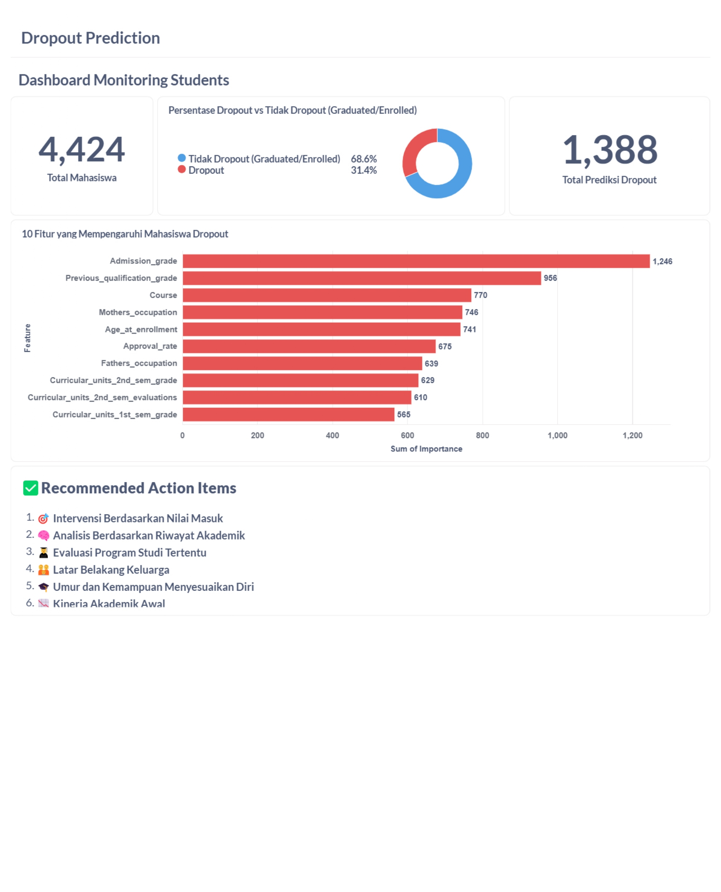

# Proyek Akhir: Menyelesaikan Permasalahan Jaya Jaya Institut

## Business Understanding

> Jaya Jaya Institut merupakan institusi pendidikan tinggi yang telah berdiri sejak tahun 2000 dan dikenal menghasilkan lulusan berkualitas tinggi. Namun, tingginya angka mahasiswa yang tidak menyelesaikan studi atau dropout menjadi permasalahan serius. Dropout tidak hanya berdampak pada reputasi institusi, tetapi juga menyebabkan kerugian finansial dan hilangnya potensi kontribusi mahasiswa. Untuk mengurangi angka dropout, Jaya Jaya Institut ingin mengimplementasikan sistem prediksi dini yang mampu mengidentifikasi mahasiswa dengan risiko tinggi dropout sejak awal masa studi.

### Permasalahan Bisnis

1. Bagaimana cara mengidentifikasi mahasiswa yang berisiko dropout sejak awal perkuliahan?
2. Faktor apa saja yang mempengaruhi kemungkinan seorang mahasiswa melakukan dropout?
3. Bagaimana visualisasi performa mahasiswa dapat membantu pihak institusi dalam pengambilan keputusan?

### Cakupan Proyek

- Melakukan eksplorasi dan visualisasi data untuk memahami distribusi dan hubungan antar fitur.
- Membangun model klasifikasi untuk memprediksi apakah seorang mahasiswa akan dropout atau tidak.
- Mengembangkan dashboard visual untuk memantau performa mahasiswa.
- Menyediakan prototype sistem prediksi yang dapat digunakan langsung melalui Streamlit.

### Persiapan

Sumber data: Dataset Student berisi informasi nilai akademik, latar belakang student, status student, dll. yang tersimpan dalam file [**employee_data.csv**](students-performance.csv) atau unduh langsung dari [dicoding_dataset](https://github.com/dicodingacademy/dicoding_dataset/tree/main/students_performance).

Setup environment:

## ⚙️Instalasi
Pastikan Anda telah menginstal semua dependensi yang dibutuhkan:
```
pip install -r requirements.txt
```

---
## 🎞️Menjalankan Proyek
1️⃣ Jalankan notebook Jupyter atau Google Colab:
   ```
   jupyter notebook Proyek_Droupout_Prediction.ipynb
   ```
2️⃣ Ikuti langkah-langkah di dalam notebook untuk melakukan pelatihan dan evaluasi model LightGBM.

3️⃣ Simpan model LightGBM yang telah dilatih, atau **jika ingin melewati proses pelatihan model pada tahap no.2** , Anda dapat langsung mengunduh file-file berikut: [LightGBM_model.pkl](LightGBM_model.pkl), [pipeline.pkl](pipeline_lightgbm.pkl), [optimal_threshold.json](optimal_threshold.json), [features_train.json](expected_columns.json), dan [top_feature_importance.csv](feature_importance.csv).

- ```LightGBM_model.pkl:``` berisi model LightGBM yang telah dilatih untuk memprediksi student yang berpotensi dropout.
- ```pipeline.pkl:``` berisi preprocessing pipeline (seperti encoding dan scaling) yang diperlukan sebelum model melakukan prediksi.
- ```optimal_threshold.json:``` menyimpan nilai threshold optimal (yaitu **0.58**) yang digunakan untuk mengubah probabilitas prediksi menjadi kelas akhir (dropout(1) atau tidak dropout(0).
- ```top_feature_importance.csv:``` berisi daftar-daftar fitur paling berpengaruh terhadap prediksi dropout, yang berguna untuk memahami faktor-faktor utama yang mempengaruhi student dropout.
- ```features_train.json``` adalah file berformat JSON yang berisi daftar nama kolom (features) yang digunakan saat melatih model. **File ini berfungsi untuk:**

1. **Validasi Input** : Memastikan bahwa setiap dataset baru yang di-upload memiliki kolom-kolom yang sama persis dengan data pelatihan.
2. **Menjaga Konsistensi** : Menjaga urutan dan keberadaan fitur sebelum dilakukan preprocessing oleh pipeline, agar transformasi dan prediksi berjalan tanpa error.

File-file ini diperlukan untuk menjalankan [app.py](app.py) tanpa perlu melatih ulang model.

4️⃣ Selanjutnya jalankan file [app.py](app.py) untuk melakukan prediksi student dropout berupa prototype model prediksi melalui Streamlit atau **jika ingin melewati tahap ini**, Anda dapat langsung mengakses prototype model melalui [Streamlit](https://proyekstudentdropoutpredicition-rifky2xe7kdqtykfxbcgcw.streamlit.app/). Berikut penjelasan mengenai tahapan dalam file tersebut:

### **📄 Penjelasan Proses dalam app.py:**
```
1. Import Library
- Mengimpor library yang diperlukan untuk pemrosesan data, pemuatan model, dan prediksi.

2. Load Model dan File Terkait
- pipeline.pkl: untuk preprocessing data (seperti encoding dan scaling).
- LightGBM_model.pkl: model LightGBM yang sudah dilatih untuk memprediksi apakah student akan di dropout.
- optimal_threshold.json: nilai threshold optimal (0.58) untuk mengubah probabilitas menjadi label prediksi (0 = tidak dropout, 1 = dropout).

3. Load Data Student
Membaca file students_performance.csv yang berisi data student yang ingin diprediksi.

4. Preprocessing Data
Data student diproses menggunakan pipeline yang sama dengan saat pelatihan model.

5. Prediksi
- Model menghasilkan probabilitas kemungkinan student di dropout.
- Probabilitas tersebut dikonversi menjadi label biner berdasarkan threshold (0.58).

6. Hasil Prediksi
- Kolom baru ditambahkan ke DataFrame:
- Predicted_Dropout: hasil prediksi apakah student akan di dropout.
- Dropout_Probability: probabilitas prediksi dari student yang akan di dropout.

7. Simpan Hasil
Hasil akhir disimpan ke file probability_export.csv.
```

## 🎯Business Dashboard

**Dashboard disusun secara berurutan untuk memberikan narasi yang jelas:**

1. Jumlah Total Student: Menunjukkan total data sebanyak 4.424 Students.
2. Prediksi Dropout: Menampilkan jumlah Student yang diprediksi dropout (1.388 atau ~31.4%).
3. Top 10 Faktor Penyebab Student Dropout: Fitur paling berpengaruh adalah Admission_grade, Previous_qualification_grade, Course, dan Mothers_occupation.
4. Strategi Retensi: Disusun berdasarkan insight yang ditemukan dari fitur-fitur penting.

## ✨Menjalankan Dashboard Metabase via Docker 

1️⃣ Konversi File ke Database SQLite

Sebelum digunakan di **Metabase**, file hasil prediksi **[probability_export.csv](probability_export.csv)** dan file **[top_feature_importance.csv](feature_importance.csv)** dikonversi menjadi database **SQLite (.db)**. Untuk melakukan konversi kedua file menjadi database SQLite, Anda dapat menjalankan kode nya pada file [convert.py](convert.py) atau Anda dapat langsung mengunduh file hasil konversi SQLite pada [Database Predicted Dropout](predicted_dropout.db).

**🔍 Mengapa Menggunakan SQLite?**
- **Kompatibilitas tinggi:** Metabase mendukung SQLite sebagai salah satu data source.
- **Mudah dan ringan:** SQLite tidak memerlukan setup server, cukup file .db saja.
- **Ideal untuk prototipe atau deployment skala kecil** seperti dashboard analitik lokal.
- **Portable:** File SQLite bisa langsung digunakan oleh Metabase tanpa konfigurasi kompleks.

2️⃣ Jalankan Metabase via Docker
- Install Docker Dekstop di situs resmi [Docker](https://docs.docker.com/desktop/setup/install/windows-install/).
- Jalankan Docker Terminal lalu buat folder **metabase-data**:
  
  ```sh
  mkdir ~/metabase-share
  ```

3️⃣ Tambah database SQLite sebagai data source di Metabase

**Cukup pindahkan file [Database Predicted Dropout](predicted_dropout.db) pada Folder metabase-share, lalu Metabase bisa langsung membaca isi tabel dan membuat dashboard-nya.**

```sh
mv predicted_dropout.db ~/metabase-share/
```

4️⃣ Menjalankan layanan Metabase menggunakan Docker Container dan menghubungkan folder lokal sebagai volume.

```sh
docker run -d -p 3000:3000 -v "C:\Users\ACER NITRO V15\metabase-share:/app/metabase-student" --name metabase_new metabase/metabase
```

**🔍 Penjelasan Kode:**

1. ```docker run:``` perintah untuk menjalankan container baru.
2. ```-d:``` menjalankan container di background (detached mode).
3. ```-p 3000:3000:``` memetakan **port 3000** di komputer host ke port 3000 di dalam container (Metabase secara default berjalan di port 3000).
4. ```-v "C:\Users\ACER NITRO V15\metabase-share:/app/metabase-student":```
   
   Menghubungkan folder lokal **(C:\Users\...)** ke folder di dalam container **(/app/metabase-student)** agar dapat berbagi file, seperti database SQLite .db.
5. ```--name metabase_new:``` memberi nama container sebagai metabase_new.
6. ```metabase/metabase:``` image resmi Metabase dari Docker Hub.

5️⃣ Akses Metabase melalui browser **```http://localhost:3000/```** lalu buat akun admin, contoh _(Username : Tsamarah Abdullah, Pass : Tsamarah192)_. Kemudian hubungkan file database yang telah tersimpan dalam folder lokal (C:\Users\ACER_NITRO_V15\metabase-share\predicted_dropout.db) ke container `/app/metabase-student/predicted_dropout.db` , atau Anda dapat langsung mengakses **Dashboard Student Monitoring :** 

.


## 📌Conclusion

---
Berdasarkan hasil evaluasi feature importance dari model LightGBM yang telah dioptimalkan, ditemukan bahwa beberapa fitur memiliki kontribusi signifikan terhadap keputusan model dalam memprediksi kemungkinan student di dropout.

---

**✅ Fitur Paling Berpengaruh:**

1️⃣ Admission_grade 
> Mewakili nilai saat masuk—indikator kesiapan awal mahasiswa.

2️⃣ Previous_qualification_grade
> Mewakili nilai pendidikan sebelumnya.

3️⃣ Course
> Jenis/jurusan studi.

4️⃣ Mothers_occupation
> Latar belakang pekerjaan ibu.

5️⃣ Age_at_enrollment
> Usia saat mendaftar.

6️⃣ Approval_rate
> Rasio lulus terhadap jumlah unit yang diambil.

7️⃣ Fathers_occupation
> Latar belakang pekerjaan ayah.

8️⃣ Curricular_units_2nd_sem_grade
> Nilai semester 2.

9️⃣ Curricular_units_2nd_sem_evaluations 
> Jumlah evaluasi semester 2.

🔟 Curricular_units_1st_sem_grade
> Nilai semester 1.

### **👥 Karakteristik Umum Student yang Berpotensi Dropout:**

Berdasarkan model prediktif, karyawan yang berisiko tinggi untuk resign cenderung memiliki karakteristik berikut:

1️⃣ Mahasiswa yang berpotensi mengalami dropout umumnya memiliki nilai masuk yang rendah, yang menjadi indikator awal kurangnya kesiapan akademik.

2️⃣ Cenderung memiliki nilai yang rendah pada kualifikasi pendidikan sebelumnya

3️⃣ Berasal dari jurusan atau program studi dengan tingkat kesulitan tinggi atau ketidaksesuaian minat.

4️⃣ Latar belakang keluarga turut memengaruhi, di mana pekerjaan orang tua yang kurang mendukung secara ekonomi atau pendidikan bisa menjadi salah satu pemicunya.

5️⃣ Faktor usia mahasiswa yang mulai kuliah juga menunjukkan kecenderungan lebih tinggi untuk keluar, kemungkinan karena memiliki tanggung jawab lain seperti pekerjaan atau keluarga.

6️⃣ Tingkat keberhasilan mereka dalam mata kuliah awal juga menjadi sinyal penting, terutama jika sejak semester pertama sudah menunjukkan nilai rendah atau jumlah evaluasi yang tidak memuaskan.

> Proyek ini berhasil mengidentifikasi potensi dropout menggunakan model machine learning (LightGBM dengan SMOTE), mencapai akurasi hingga **90%**, serta mengoptimalkan **threshold** prediksi untuk hasil yang lebih akurat.

**Model menunjukkan bahwa potensi mahasiswa untuk dropout sangat dipengaruhi oleh kombinasi faktor akademik seperti (jumlah mata kuliah yang disetujui, nilai rata-rata, dan status pembayaran) dan faktor personal, termasuk (usia saat mendaftar, kondisi keuangan, serta latar belakang pendidikan orang tua).**

---

## 💡Rekomendasi Action Items

**✅ Berikut beberapa langkah strategis yang dapat dilakukan Institut Jaya Jaya:**

1. 🎯 **Intervensi Berdasarkan Nilai Masuk**

  **Insight:** Mahasiswa dengan nilai masuk rendah (Admission_grade) sangat rentan dropout.

  **Action:** Berikan program matrikulasi atau bimbingan belajar tambahan sejak awal semester.

2. 🧠 **Analisis Berdasarkan Riwayat Akademik**

  **Insight:** Nilai pendidikan sebelumnya (Previous_qualification_grade) juga krusial.

  **Action:**

- Identifikasi mahasiswa dengan nilai akademik sebelumnya rendah.
- Terapkan sistem early warning berdasarkan performa awal.


3. 🧑‍🎓 **Evaluasi Program Studi Tertentu**

  **Insight:** Fitur Course cukup berpengaruh—mungkin ada jurusan dengan dropout tinggi.

  **Action:**

- Lakukan audit akademik dan psikososial terhadap jurusan dengan dropout tinggi.

- Perbaiki kurikulum, tingkat stres, atau beban SKS.

4. 👪 **Latar Belakang Keluarga**

  **Insight:** Pekerjaan orang tua (terutama ibu) berdampak besar.

  **Action:**

- Berikan pendampingan finansial/psikologis kepada mahasiswa dari keluarga rentan.

- Buka akses beasiswa berdasarkan kondisi sosial-ekonomi.

5. 🎓 **Umur dan Kemampuan Menyesuaikan Diri**

  **Insight:** Usia saat mendaftar (Age_at_enrollment) berpengaruh—mungkin terkait adaptasi dan tanggung jawab keluarga.

  **Action:**

- Sediakan layanan konseling untuk mahasiswa usia non-tradisional.

- Buat kelompok belajar lintas usia.

6. 📉 **Kinerja Akademik Awal**

  **Insight:** Nilai dan evaluasi pada semester 1 & 2 penting.

  **Action:**

- Implementasi sistem pemantauan nilai mingguan.

- Kirim alert ke dosen PA dan akademik jika nilai mulai menurun.

---

📧 Hubungi saya melalui [GitHub](https://github.com/MuthiahAinun) jika ada pertanyaan 😊.

---
